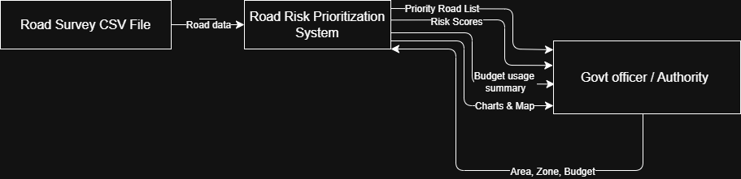
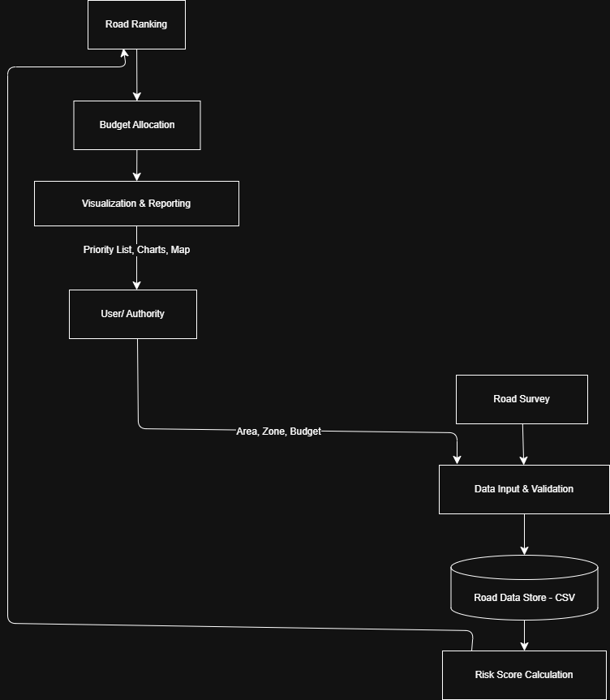

# 🛣️ Road Infrastructare Risk & Repair Prioritzation System
**Domain:** Governance / Infrastructure Planning

---

## 1. Overview

This project is a web-basd decision support system that helps government authoities **prioritize road repairs objectively** using data instead of manual judgment or reactive complaints.

The system analyzes road safety indictors such as **accident history**, **traffic exposure**, and **weather vulnerability**, and then produces a **budget-aware repair priority list**.

It supports real-world usage by allowing **CSV uploads**, **interactive maps**, and **visual risk summaries**.

---

## 2. Problem Statement

Urban road maintnance is often reactive and constrained by limited budgets. As a result:

* High-risk roads may remain unattended
* Repair decisions lack transparency
* Funds are not optimally allocated

There is a need for a **simple, explainable and data-driven system** that assists authorities in identifying:

* Which roads are most risky
* How severe the risk is
* Which roads can realistically be repaired within a budget

---

## 3. Proposed Solution

The system functions as a **decision support tool** that:

1. Accepts road data through CSV files
2. Validates and processes the data
3. Calculates a Risk Score for each road
4. Ranks roads based on severity
5. Selects roads within the available budget
6. Visualizes results using charts and maps

This ensures **fair, consistent and transparent planning**.

---

## 4. System Architecture

The system consists of the following components:

* Web Dashboard (HTML, CSS, JavaScript)
* Flask Backend API
* Risk Calculation Engine
* CSV-based Data Store
* Map & Visualization Layer

**High-level Data Flow:**
User → Web UI → Flask API → Risk Engine → Data Store → Flask API → Web UI → User

The diagram below illustrates the high-level structure of the system and the interaction between frontend, backend, risk engine, and data storage.


---

## 5. Data Flow Diagrams

### DFD Level-0 (Context Diagram)

Shows interaction between:

* Government Authority
* Road Risk Prioritization System
* CSV Data Source

**Inputs:**
Area, Zone, Budget, CSV File

**Outputs:**
Risk Scores, Priority Road List, Charts, Interactive Map

This diagram shows the system as a single process and its interaction with external entities.




---

### DFD Level-1 (Detailed Flow)

Internal processes include:

1. Data Input & Validation
2. Risk Score Calculation
3. Road Ranking & Budget Allocation
4. Visualization & Reporting

**Flow:**
User & CSV → Validation → Data Store → Risk Engine → Ranking → Visualization → User

This diagram presents the internal data flow, including validation, risk calculation, ranking, and reporting.




---

## 6. Risk Score Model

Each road is assigned a Risk Score using a weighted model:

**Risk Score =**
(w₁ × Accident Index) +
(w₂ × Traffic Index) +
(w₃ × Weather Vulnerability)

All values are normalized to allow fair comparison.
Weights are defined in the backend logic and can be adjusted by developers.

---

## 7. Budget-Aware Prioritization

After ranking roads by risk severity, the system selects roads sequentially while ensuring the **total repair cost does not exceed the given budget**.

This produces a **realistic and implementable repair plan**.

---

## 8. Data Storage

CSV files are used as the primary data store to keep the system lightweight and easy to deploy.

Users can:

* Use the default dataset
* Upload their own CSV files

---

## 9. CSV Input Format

**Required Columns:**

```
road_id
road_name
area
zone
latitude
longitude
accidents
traffic
weather_vulnerability
repair_cost
```

**Example:**

```
1,MG Road,Bengaluru,Central,12.9716,77.5946,15,0.7,0.5,55000
```

---

## 10. Frontend & Visualization

The dashboard provides:

* Area & zone filters
* CSV upload functionality
* Budget input
* Risk distribution charts
* Interactive map displaying road locations

This converts raw data into **actionable insights**.

---

## 11. Failure Handling

The system validates uploaded CSV files and prevents processing of incomplete or invalid data.
Only verified data is used for risk calculation.

---

## 12. Scalability (Design Considerations)

The system is designed to be extensible:

* CSV storage can be replaced by databases
* APIs can integrate live traffic or weather data
* Risk engine remains independent of the UI

---

## 13. Team Contributions

**Team Leader **
**Member 1**

* System integration 
* Risk score model design
* Backend API coordination
* Git workflow & code reviews

**Member 2**

* Frontend UI development
* Risk score model design
* Data processing & CSV validation
* Map & chart visualization

**Member 3**

 * Frontend UI development
  * System architecture design

**Member 4**


 * Map & chart visualization
* Documentation & conceptual database design

All work was managed using feature branches and pull requests.

---

## 14. How to Run

Install dependencies:

```
pip install -r backend/requirements.txt
```

Run the application:

```
python run.py
```

Open in browser:

```
http://localhost:5000
```
   
