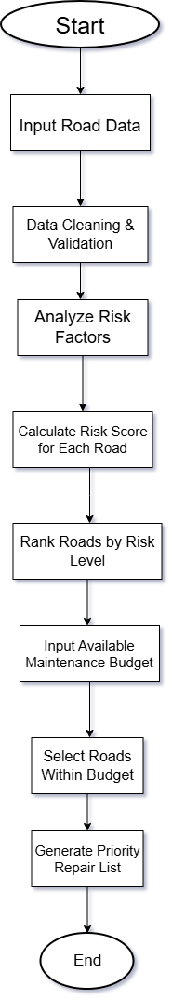

# Road Infrastructure Risk & Repair Prioritization System

## Domain
**Governance**

## Project Description

This project presents a data-driven decision support system to help government authorities plan road maintenance in a more proactive and transparent manner. Instead of reacting only after accidents or complaints, the system evaluates road risk using accident history, traffic exposure, and weather impact. Based on this evaluation, it generates a prioritized list of road segments for maintenance within the available budget.

## Problem Statement

In many cities, road maintenance decisions are taken only after accidents occur or when a large number of complaints are received. This reactive approach delays action even when some roads are already unsafe and likely to deteriorate further. As a result, high-risk road segments remain unnoticed until serious damage or accidents happen.

Additionally, authorities operate under limited maintenance budgets and often lack a clear, data-driven method to decide which roads should be repaired first. This leads to inefficient use of public funds and inconsistent road safety outcomes.

## Proposed Solution

The proposed system shifts road maintenance planning from a complaint-driven approach to a **risk-based decision model**. It analyzes accident data, traffic volume, and weather vulnerability to compute a **Risk Score** for each road segment.

Roads are ranked based on this score, and a **priority repair list** is generated according to the available maintenance budget. The system focuses on **decision support rather than automation** in Round-1.

## Risk Score Formulation

To ensure transparency and avoid subjective decision-making, the system calculates a Risk Score using a simple weighted combination of key factors:

**RS = (w₁ × A) + (w₂ × T) + (w₃ × W)**

Where:

* **A** = Normalized Accident Frequency (0–1)
* **T** = Traffic Volume Index (0–1)
* **W** = Weather Vulnerability Coefficient (0–1)

**Example weight configuration:**

* Accidents: 0.5
* Traffic: 0.3
* Weather: 0.2

The weights are configurable and sum to 1, making the prioritization logic **clear, explainable, and suitable for an initial prototype**.

## System Flow (Round-1)

**Flowchart Reference:**
See `flowchart.png` in the repository.

**Flow Overview:**

Start
↓
Collect Road Data
↓
Data Cleaning & Validation
↓
Analyze Risk Factors
↓
Calculate Risk Score for Each Road
↓
Rank Roads by Risk Level
↓
Input Available Maintenance Budget
↓
Select Roads Within Budget
↓
Generate Priority Repair List
↓
End

## Flowchart Explanation (Round-1)

The system begins by collecting road-level data such as accident history, traffic volume, and weather impact. This data is cleaned and validated to ensure reliable analysis. Each road is evaluated by analyzing individual risk factors, which are combined to calculate a Risk Score.

Roads are then ranked based on their risk level. The available maintenance budget is applied to select the most critical roads, resulting in a prioritized repair list that supports informed decision-making.

## Key Features

* **Explainable Risk Scoring:** Clear and transparent prioritization logic
* **Multi-Factor Risk Analysis:** Considers accidents, traffic, and weather
* **Budget-Aware Prioritization:** Generates realistic repair lists
* **Decision Support Focus:** Assists planners without over-automation
* **Governance-Friendly Design:** Easy to interpret by non-technical stakeholders

## User Personas

* **City Planners:** Identify high-risk road segments and plan maintenance schedules
* **Finance Officials:** Allocate limited budgets effectively
* **Field Engineers:** Use prioritized repair lists for maintenance execution

This ensures decisions align with real administrative roles.

## Edge Case Handling

If multiple roads receive similar Risk Scores:

1. Priority is given to the road with higher accident frequency
2. Traffic exposure is used as a secondary criterion

This ensures consistent and safety-focused decision-making.

## Prototype

For Round-1, the prototype focuses on **demonstrating the core decision logic only**, rather than full system deployment.

A minimal Python-based script (`prototype_demo.py`) is included in the repository. It uses **mock road data** to demonstrate:

* Risk Score calculation
* Road ranking
* Cost-aware prioritization

**Scope Note:** Advanced components such as real-time data integration, predictive modeling, and automated feedback mechanisms are **conceptual only** and not implemented in the Round-1 prototype.

## Planned Enhancements for Round-2

Future improvements include:

* Real-time data integration
* Advanced budget optimization techniques
* Predictive maintenance models
* Role-based dashboards for stakeholders
* **Post-Repair Impact Evaluation:** Assess changes in accident frequency and traffic conditions after repairs to inform future prioritization decisions.

